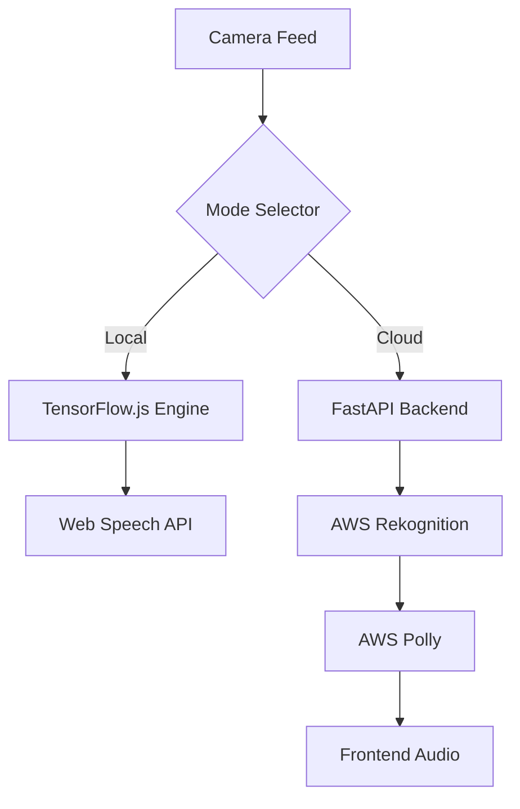

# Vision Assist: Real-Time AI Narration System

[](https://realtime-vision-assit.netlify.app/)
[](https://reactjs.org/)
[](https://vitejs.dev/)
[](https://fastapi.tiangolo.com/)
[](https://aws.amazon.com/)
[](https://www.tensorflow.org/js)

Vision Assist is a comprehensive real-time object detection and narration platform designed for visual accessibility. The system leverages both edge-based detection and cloud-scale analysis to provide low-latency environmental feedback.

---

## Technical Overview

The application operates in two distinct modes to balance privacy, cost, and accuracy:

*   **On-Device Processing:** Utilizes TensorFlow.js (COCO-SSD) and the Web Speech API for local, private, and zero-cost detection.
*   **Cloud Analysis:** Orchestrates a FastAPI backend using AWS Rekognition for high-resolution label detection and AWS Polly for natural voice synthesis.

---

## Core Features

*   **Real-Time Processing:** Low-latency object identification through optimized camera streams.
*   **Intelligent Narration:** Context-aware speech feedback with deduplication logic.
*   **Responsive UI:** Mobile-first design built with React and Tailwind CSS.
*   **Hybrid Architecture:** Seamless switching between client-side and server-side processing.

---

## System Architecture



---

## Installation and Setup

### Frontend Environment

1. Install project dependencies:
    ```bash
    npm install
    ```

2. Launch the development server:
    ```bash
    npm run dev
    ```

### Backend Environment (AWS Mode)

1. Configure the virtual environment:
    ```bash
    cd backend
    python -m venv .venv
    # Windows
    .\.venv\Scripts\activate
    # Linux/macOS
    source .venv/bin/activate
    pip install -r requirements.txt
    ```

2. Establish Configuration (`backend/.env`):
    ```env
    AWS_REGION=us-east-1
    AWS_ACCESS_KEY_ID=your_access_key
    AWS_SECRET_ACCESS_KEY=your_secret_key
    POLLY_VOICE_ID=Joanna
    ```

3. Initialize the API:
    ```bash
    uvicorn main:app --reload --host 127.0.0.1 --port 8000
    ```

---

## Deployment

### Containerization

The project is fully Docker-enabled for standardized deployment:

```bash
docker compose up --build
```

### Static Hosting

The frontend is optimized for deployment on platforms like Netlify or Vercel.
Live URL: [https://realtime-vision-assit.netlify.app/](https://realtime-vision-assit.netlify.app/)

---

## Development Stack

*   **Interface:** React, Tailwind CSS, Lucide Icons, Shadcn UI
*   **Backend:** FastAPI, Boto3, OpenCV
*   **Intelligence:** TensorFlow.js, AWS Rekognition, AWS Polly

---

## License

Distributed under the MIT License. See `LICENSE` for more information.

---

Developed for Visual Accessibility Enhancement
